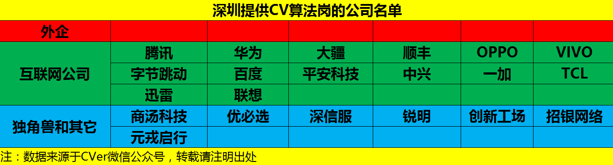
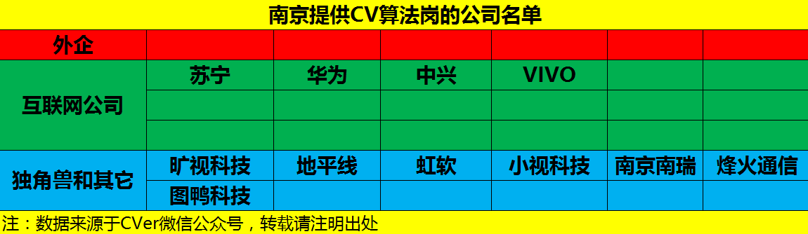

# CV-Jobs
国内提供计算机视觉(CV)算法岗位的公司名单(含外企和国内公司)，欢迎大家提交issues进行补充

- [AI算法岗求职攻略](https://github.com/amusi/AI-Job-Notes)：涵盖校招时间表、准备攻略、刷题指南、内推、AI公司清单和答疑等资料
- [深度学习面试宝典](https://github.com/amusi/Deep-Learning-Interview-Book)：含数学、机器学习、深度学习、计算机视觉、自然语言处理和SLAM等方向）

<!-- MarkdownTOC depth=4 -->

- [北京](#Beijing)
- [上海](#Shanghai)
- [深圳](#Shenzhen)
- [杭州](#Hangzhou)
- [南京](#Nanjing)
- [成都](#Chengdu)
- [广州](#Guangzhou)
- [TODO](#TODO)

# 北京

**【外企】**

- 微软（Microsoft）
- 谷歌（Google）
- 亚马逊（Amazon）
- 英特尔（Intel）
- Hulu
- IBM

**【（互联网）公司】**

- 百度（Baidu）
- 腾讯（Tencent）
- 字节跳动（ByteDance）
- 京东（JD）
- 美团
- 小米
- 阿里巴巴
- 滴滴出行
- 华为
- 快手
- 爱奇艺（iQIYI）
- 优酷
- 58同城
- 360
- 搜狗
- 新浪
- 联想（Lenovo）
- 科大讯飞
- 猎豹
- 搜狐
- 苏宁
- 高德地图
- 陌陌（MOMO）
- 贝壳找房
- 平安科技

**【独角兽和其他】**

- 商汤科技（SenseTime）
- 旷视科技（MEGVII）
- 依图科技
- 小马智行（Pony.ai）
- 图森未来（TuSimple）
- 创新工场
- Momenta
- 文远知行
- 寒武纪
- 地平线
- 第四范式
- 四维图新
- 格林深瞳
- 中科视拓
- 猿辅导
- 好未来
- 优必选
- 视见科技
- 纵目科技
- 驭势科技 
- 大恒图像
- 特斯联
- 作业帮
- 京东方
- 蔚来汽车
- 小鹏汽车
- 深睿医疗
- 爱笔（Aibee）
- 美图
- 速感科技

# 上海

# 深圳

# 杭州

# 南京

# 成都

# 广州

# TODO

- [ ] 武汉
- [ ] 合肥