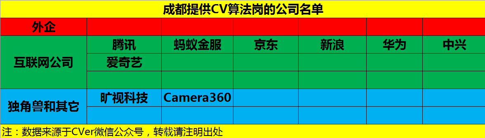
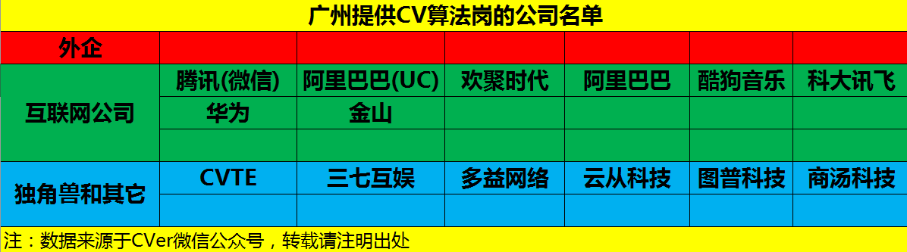

# CV-Jobs
国内提供计算机视觉(CV)算法岗位的公司名单(含外企和国内公司)，欢迎大家提交issues进行补充

- [AI算法岗求职攻略](https://github.com/amusi/AI-Job-Notes)：涵盖校招时间表、准备攻略、刷题指南、内推、AI公司清单和答疑等资料
- [深度学习面试宝典](https://github.com/amusi/Deep-Learning-Interview-Book)：含数学、机器学习、深度学习、计算机视觉、自然语言处理和SLAM等方向）

<!-- MarkdownTOC depth=4 -->

- [北京](#Beijing)
- [上海](#Shanghai)
- [深圳](#Shenzhen)
- [杭州](#Hangzhou)
- [南京](#Nanjing)
- [成都](#Chengdu)
- [广州](#Guangzhou)
- [TODO](#TODO)

# 北京

**【外企】**

- 微软（Microsoft）
- 谷歌（Google）
- 亚马逊（Amazon）
- 英特尔（Intel）
- Hulu
- IBM

**【（互联网）公司】**

- 百度（Baidu）
- 腾讯（Tencent）
- 字节跳动（ByteDance）
- 京东（JD）
- 美团
- 小米
- 阿里巴巴
- 滴滴出行
- 华为
- 荣耀
- 快手
- 爱奇艺（iQIYI）
- 优酷
- 58同城
- 360
- 搜狗
- 新浪
- 联想（Lenovo）
- 科大讯飞
- 猎豹
- 搜狐
- 苏宁
- 高德地图
- 陌陌（MOMO）
- 贝壳找房
- 平安科技
- 中国电信

**【独角兽和其他】**

- 商汤科技（SenseTime）
- 旷视科技（MEGVII）
- 依图科技
- 小马智行（Pony.ai）
- 图森未来（TuSimple）
- 创新工场
- Momenta
- 文远知行
- 寒武纪
- 地平线
- 第四范式
- 四维图新
- 格林深瞳
- 中科视拓
- 猿辅导
- 好未来
- 优必选
- 视见科技
- 纵目科技
- 驭势科技 
- 大恒图像
- 特斯联
- 作业帮
- 京东方
- 蔚来汽车
- 小鹏汽车
- 理想汽车
- 集度汽车
- 深睿医疗
- 爱笔（Aibee）
- 美图
- 速感科技
- 安德医智（BioMind）
- 医准智能
- 鉴智机器人
- 超星未来
- 易控智驾
- 国汽智联

# 上海

**【外企】**

- 亚马逊（Amazon）
- 英伟达（NVIDIA）
- 英特尔（Intel）
- IBM
- 高通

**【（互联网）公司】**

- 阿里巴巴
- 腾讯（Tencent）
- 百度（Baidu）
- 字节跳动（ByteDance）
- 京东（JD）
- 拼多多
- 华为
- 爱奇艺（iQIYI）
- 携程
- 58同城
- 欢聚时代
- 平安科技
- OPPO
- 美团
- 海康威视
- 哔哩哔哩（Bilibili）

**【独角兽和其他】**

- 商汤科技（SenseTime）
- 旷视科技（MEGVII）
- 依图科技
- 云从科技
- 联影医疗
- 深兰科技
- 纵目科技
- 寒武纪
- 地平线
- 蔚来汽车
- 小鹏汽车
- 理想汽车
- 集度汽车
- 威马汽车
- 哪吒汽车
- 禾赛科技
- 豪威科技
- 虹软科技
- 奥比中光
- Insta360影石
- 触宝
- 欧菲科技
- 七牛云
- 英语流利说
- 纽劢科技
- 云知声
- 思岚科技
- 哈啰出行
- [嬴彻科技](https://www.inceptio.ai/)
- 上汽
- 中国银联
- 中国电信
- 招商银行信用卡中心
- 上海人工智能实验室
- 浦江实验室
- 鉴智机器人
- 高仙机器人
- 仙途
- 禾多科技
- 福瑞泰克

# 深圳

**【外企】**

- 无

> 注：虽然有IBM、微软、甲骨文等外企，但Amusi 未了解到有提供CV算法岗的信息

**【（互联网）公司】**

- 腾讯（Tencent）
- 华为
- 大疆（DJI）
- 顺丰
- OPPO
- VIVO
- 字节跳动（ByteDance）
- 百度（Baidu）
- 比亚迪
- 平安科技
- 中兴
- 荣耀
- 一加
- TCL
- 迅雷
- 联想

**【独角兽和其他】**

- 商汤科技
- 小鹏汽车
- 文远知行
- AutoX
- 优必选
- 深信服
- 奥比中光
- 锐明科技
- 创新工场
- 招银网络
- 元戎启行
- Insta360影石
- 镭神智能
- 码隆科技
- 招银网络科技
- 如本科技
- 捷顺科技
- 迈瑞医疗

# 杭州

**【（互联网）公司】**

- 阿里巴巴
- 网易
- 华为
- VIVO
- 滴滴
- 海康威视
- 大华
- 宇视科技
- 搜狗
- 新浪

**【独角兽和其他】**

- 商汤科技
- 依图科技
- 图普科技
- 虹软
- 蘑菇街
- 招银网络
- 同花顺
- 微泰医疗
- 启明医疗
- 酷家乐
- 新华三集团
- 之江实验室
- 中电海康
- 吉利
- 宏景智驾
- 零跑汽车
- 飞步科技
- 福瑞泰克
- 鉴智机器人
- 舜宇集团

# 南京

- 华为
- 中兴
- vivo
- 平安科技
- 地平线
- 苏宁
- 一汽南京
- 中汽创智
- 旷视科技
- 虹软
- 图鸦科技
- OneFlow（一流科技）
- 小视科技
- 埃克斯工业
- 南京南瑞
- 烽火通信
- 阿维塔科技
- 致远慧图
- 中盈优创资讯科技
- 江苏盘古机器人科技
- 南京安科医疗科技
- 鹏力科技集团
- 图漾科技
- 南京和光制造研究院
- 南京智欧智能技术研究院

# 成都

# 广州

**【外企】**

- 无

> 注：虽然有IBM、微软、甲骨文等外企，但Amusi 未了解到有提供CV算法岗的信息

**【（互联网）公司】**

- 腾讯（Tencent）
- 网易
- 欢聚时代
- 酷狗
- 金山
- 唯品会

**【独角兽和其他】**

- 小鹏汽车
- 小马智行
- 文远知行
- CVTE
- 三七互娱
- 多益网络
- 禾多科技

注：下图还未及时更新，请以上面文字版为准

# TODO

- [ ] 武汉
- [ ] 合肥